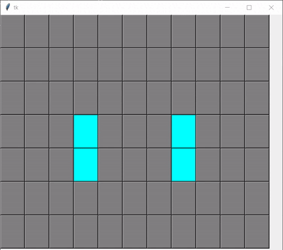

Игру «Жизнь» изобрел математик Джон Хортон Конвей в 1970 году. 

Правила игры «Жизнь» достаточно простые:

«Жизнь» разыгрывается на бесконечном клеточном поле.
У каждой клетки 8 соседних клеток.
В каждой клетке может жить существо.
Существо с двумя или тремя соседями выживает в следующем поколении, иначе погибает от одиночества или перенаселённости.
В пустой клетке с тремя соседями в следующем поколении рождается существо [1].

These rules, which compare the behavior of the automaton to real life, can be condensed into the following:

Any live cell with two or three live neighbours survives.
Any dead cell with three live neighbours becomes a live cell.
All other live cells die in the next generation. Similarly, all other dead cells stay dead.

try:
    import tkinter as tk
except ImportError:
    import Tkinter as tk

[[3,1], [4,3], [4,2], [5,4], [5,3], [6,4]]

## Demo

 

## Sources

> [https://github.com/igorbrodzinski/game-of-life-tkinter](https://github.com/igorbrodzinski/game-of-life-tkinter)

> [https://github.com/ColeB2/GameofLife](https://github.com/ColeB2/GameofLife)

> [https://forum.level1techs.com/t/game-of-life-python-tkinter/113480/4](https://forum.level1techs.com/t/game-of-life-python-tkinter/113480/4)

> [https://stackoverflow.com/questions/35106391/game-of-life-python-too-many-resources](https://stackoverflow.com/questions/35106391/game-of-life-python-too-many-resources)

> [https://python-course.eu/tkinter/the-game-of-life-in-python.php](https://python-course.eu/tkinter/the-game-of-life-in-python.php)

> [https://question-it.com/questions/2525866/pochemu-moja-realizatsija-tkinter-game-of-life-postepenno-zamedljaetsja](https://question-it.com/questions/2525866/pochemu-moja-realizatsija-tkinter-game-of-life-postepenno-zamedljaetsja)

> [https://github.com/Edgar-LZ/Game-of-life](https://github.com/Edgar-LZ/Game-of-life)

> [https://pastebin.com/e6ED24H8](https://pastebin.com/e6ED24H8)

> [GIF Maker](https://ezgif.com/)